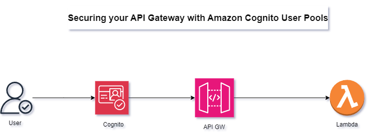
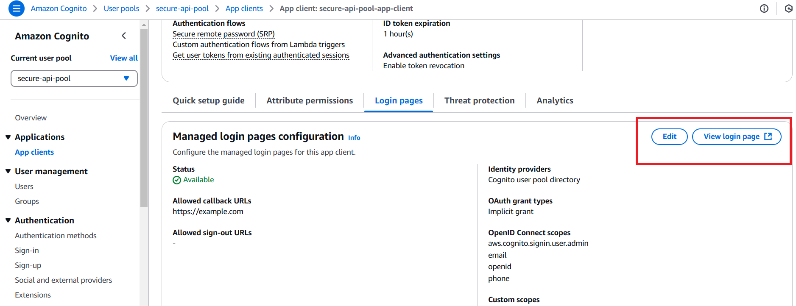
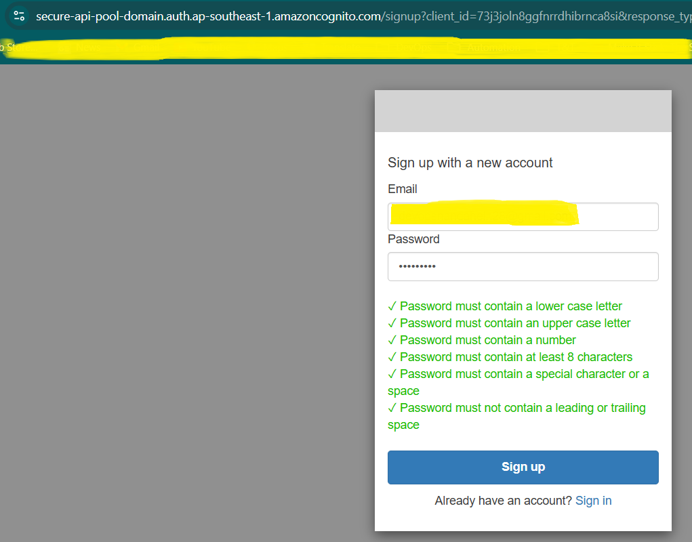
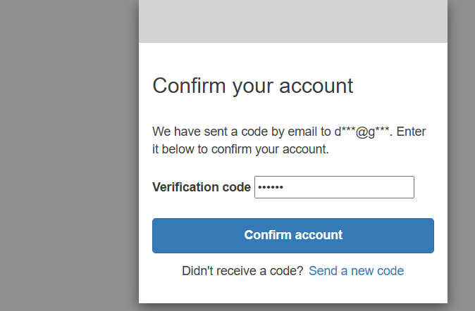
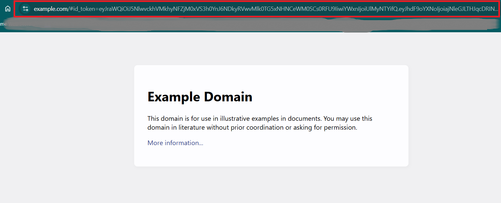
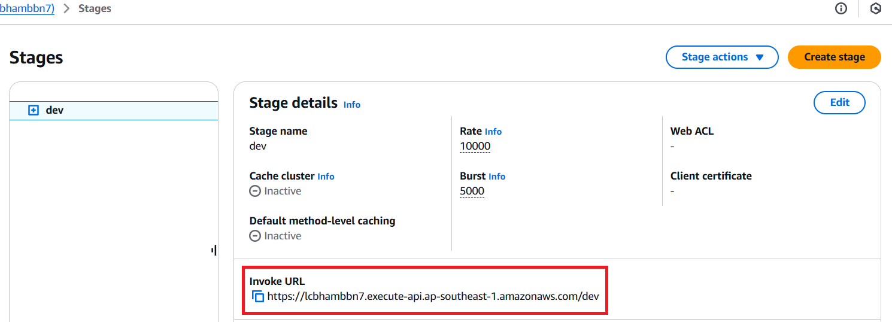
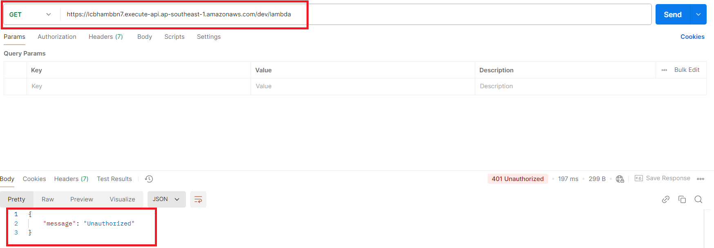
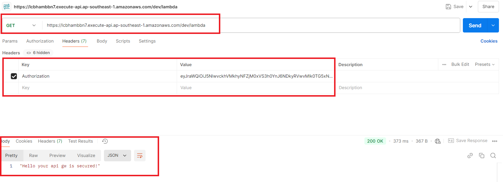

## Securing your API Gateway with Amazon Cognito User Pools Overview Diagram

## Implementation Guide

After successfully provisioned with terraform,

1. Go to the login page url

    

2. Create a new account with your email address

    

3. Confirm you account with the verification code

    

4. After successfully login you account, copy and save the url into your machine which will be used later when you connect api gateway with the ***id token***

    

5. Copy the api gateway stage url and save into your machine

    

6. GUI(POSTMAN)

     We can also use a popular API testing tool called Postman. It’s available for Windows, Mac, and Linux.

    It can be downloaded for free from their website: https://www.postman.com/downloads/

    Once you’ve opened Postman, click on the + up the top of the application to open a new tab. Set the method to GET, and enter your API Gateway URL.

    When you call the API Gateway URL with no authorization, you will get ***unauthorized error***

    

7. Once you have called the API Gateway URL with id token through cogito user pool, you can call the API GW successfully

    

